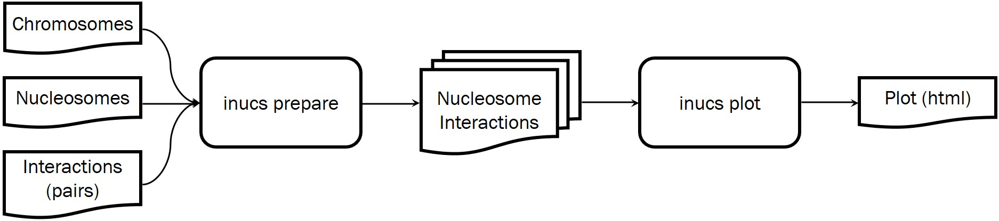

# iNucs

Given a nucleosomes file and a DNA interactions files in [pairs format](https://github.com/4dn-dcic/pairix), the `inucs` ommandline tool bins intractions falling into different nucloesomes and counts them.

## How to Use
As depicted in the following figure, there are two main steps for using `inucs`:



Thus, the two major task are `prepare` and `plot`:
* `prepare`

  In this step, the potentially large input files are broken into smaller peices and corresponding Nucleosome-Nucleosome Interaction Matrices are build. All of these activities are happening automatically, and the user does not need to do anything after running the `prepare` command (see below).

* `plot`
  
  In this step, the user can specify a particular range on a chromosome. The corresponding intermediary files for the specified range are auto-generated, and an interactive plot is created in html format, which can be opened in any standard browser such as Chrome.

### Built-in Help
Every stage of the program comes with standard help messages, which are accessable by command line flag `-h` or `--help`.

Overall help:
```bash
./inucs.py --help
```
which outputs:
```
usage: inucs.py [-h] [-q] {prepare,plot} ...
...
```

Help for `prepare` command:
```bash
./inucs.py prepare --help
```
which outputs:
```
usage: inucs.py prepare [-h] [-d <working_dir>] [--refresh] <chroms_file> <nucs_file> <interas_file>
...
```

Help for `plot` command:
```bash
./inucs.py plot --help
```
which outputs:
```
usage: inucs.py plot [-h] [-p <outfile_prefix>] [-s] <working_dir> <chrom> <start_region> <end_region>
...
```

### Commandline Examples:

First step:
```
./inucs.py prepare Chromosomes_Yeast.tsv Nucleosome_Yeast.tsv.gz Yeast.tsv -d yeast_working_dir
```

Depending on the size of input files and the system specifications, the `prepare` command may take a few minutes or more to complete. The output folder may be specified 


```
./inucs.py plot yeast_working_dir II 10000 50000
```


Graph: usage pipe line


---
## Efficiency

Achieving linear algorithm and and utilization of vectorization provided by Numpy/Pandas with hardware support.


Graph: how efficiency is achieved

TODO: In the current version, we are not utilising parallelism for higher utilization of multicore CPUs.

---
## Scalability
The `inucs` tool is very scalable in the sense that it can handle large amounts of input data without requiring more exceeding computational resources. For example, it is possible to feed into `inucs` human chromosome interactions exceeding 100 GB and run this the utility on an average PC. Of course, still adding higher hardware capabilities will impact the runtime efficiency.

Scalability in `inucs` is achieved primarily be breaking down the data in different stages of running the program. Therefore, at any given time, there is only some manageable chunck of data in memory, and the intermediary results are constantly written on storage space and read back in as needed.

Some important break downs of data are as follows
* Input: Interactions between chromosome locations

   Broken into chromosomes and strands
   
* Nucleosome-Nucleosome Interaction Matrix

   Broken into chromosomes and strands
   
* Submatix

   A smaller range from the above matrix is selected by specifying: chromosome beginning-of-range end-of-range

---
## Running time measurements

Yeast | Human 

Size of Data vs runtime

' '  | 1GB | 10GB | 100GB
---|---|---|---   
PC |   |   |
HPC |   |   |

Specifications:

' '  | Ram | Cores | OS
---|---|---|---   
PC | 16 | 8 | Linux
HPC |   |   | Linux


System 16G RAM:
Yeast with 24163427 interactions

Windows:

Yeast zipped    Prepared working directory: Yeast.irg[.zipped] in 6.3 minutes

Yeast unzipped  Prepared working directory: Yeast.irg[.unzipped] in 3.1 minutes

Linux:

Yeast zipped    Prepared working directory: Yeast.irg[.zipped] in 4.2 minutes

Yeast unzipped  Prepared working directory: Yeast.irg[.unzipped] in 2.4 minutes
