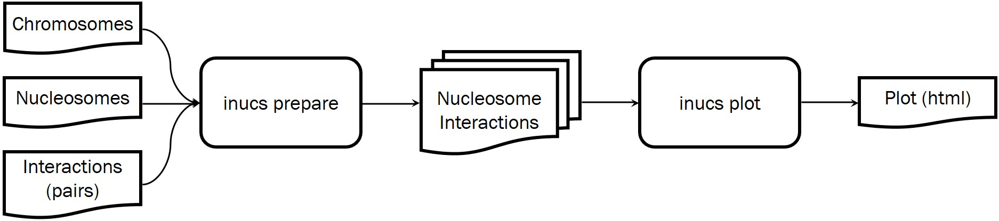
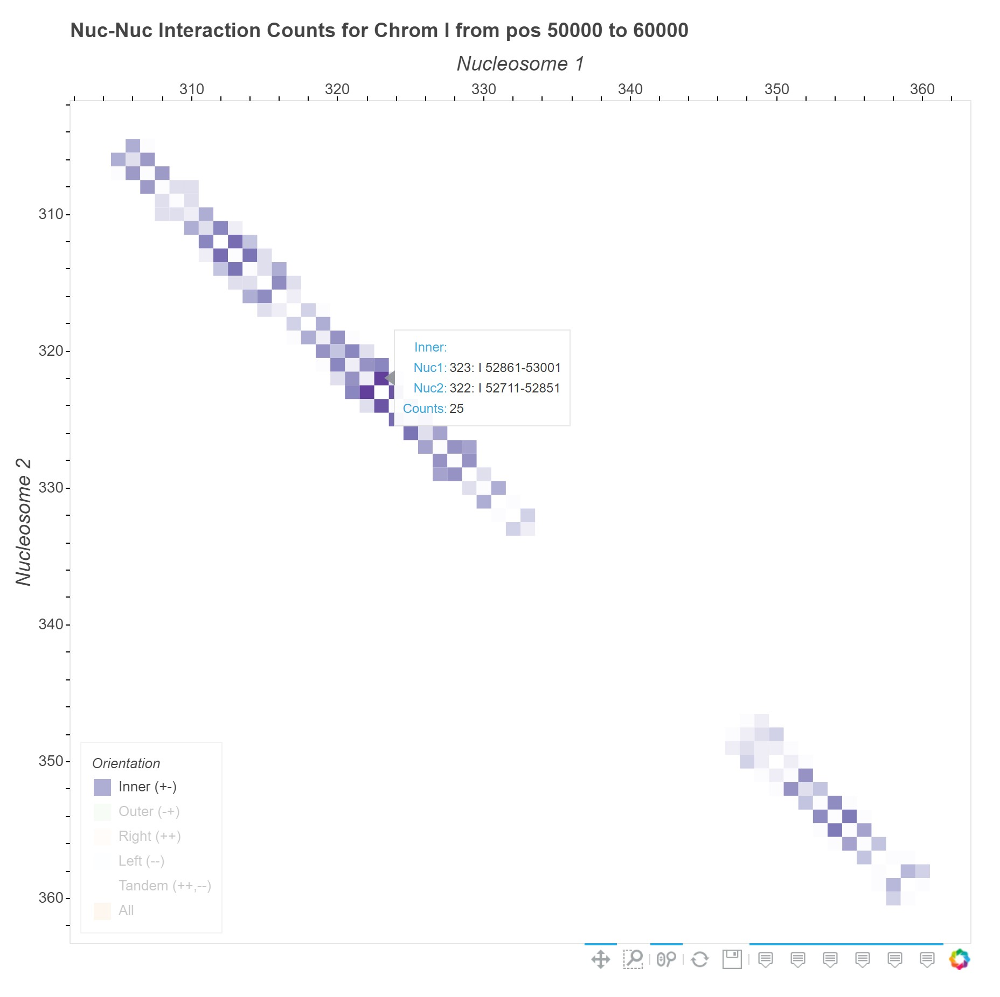

# iNucs: Inter-Nucleosome Interactions

Given nucleosome genomic coordinates, ligation junctions (in pairs format) produced by the [Pairtools](https://pairtools.readthedocs.io/en/latest/) program, the `inucs` command line tool identifies interactions falling into different nucleosomes and counts them. Here, we discuss the following aspects of `inucs` program:

1. [Installation](#1-installation)
2. [Usage](#2-usage)
3. [Algorithms](#3-algorithms)


------
## 1 Installation

1. Install [Anaconda](https://www.anaconda.com/products/individual) with Python 3.8 or above.
2. Install the `inucs` dependencies using Anaconda. In a terminal where anaconda is activated type:

```bash
conda install numpy pandas bokeh
```
Then, the fully self-contained python script, [`inucs.py`](./inucs.py), can be directly executed; for example: 

```bash
python inucs.py --help
```

Or, if you give the script execution permission via `chmod u+x inucs.py`, then simply:

```bash
./inucs.py --help
```


------
## 2 Usage





As depicted in the figure above,  `inucs` running involves two main steps: `prepare` and `plot`. There is a built-in help provided for each stage of the program, which are accessible via command line flags `-h` or `--help`.

For overall help, use the command:

```bash
./inucs.py --help
```

which outputs:

```
usage: inucs.py [-h] [-q] {prepare,plot} ...

(omitted for brevity...)
```

The curly brackets `{}` denote that either of `prepare` or `plot` can be used as a command to the program. The `-h` flag is to print help message, and `-q` suppresses the program progress output.

### 2.1 The `prepare` Command

In this step, a potentially large interaction pairs file is broken into smaller pieces and the corresponding nucleosome-nucleosome interaction matrices are built.

To access the built-in help for `prepare` command, issue:

```bash
./inucs.py prepare --help
```

which outputs:

```
usage: inucs.py prepare [-h] [-d <working_dir>] [--refresh] [-z] <chroms> <nucs> <interacts>

(omitted for brevity...)
```


  * Input

    All input files can optionally be compressed using the `gzip` format, in which case they need to use `.gz` file extension.

    * `<chroms>`: a file listing the chromosomes of interest

    * `<nucs>`: a file containing nucleosome genomic coordinates

    * `<interacts>`: a file containing interaction pairs produced by the [Pairtools](https://pairtools.readthedocs.io/en/latest/) program

      

  * Output
    
    * `<working_dir>`: a folder containing all the intermediary and cached files. These include the resulting matrices with nucleosome-nucleosome interaction counts. Specifying the `<working_dir>` is optional, and if missing, the program will auto-generate a name based on the name of the interactions input file, `<interacts>`.
    
      If the optional `-z` flag is used, the intermediary files in the `<working_dir>` will be compressed using the `gzip` format.
    
      If the optional `--refresh` flag is used, it starts from scratch and recreates the intermediary files as needed.


### 2.2 The `plot` Command

The results produced by the `prepare` command are stored in the `<working_dir>` folder, from which the  `plot` command can produce heatmap plots of nucleosome-nucleosome interaction counts matrix. The user specifies the DNA region of interest, and the program finds out nucleosomes within that region, and selects the submatrix nucleosome interactions within the user-specified DNA region. The final output of the `plot` command is a [Bokeh](https://bokeh.org/) interactive plot in `html` format, which can be opened in any standard browser such as Google Chrome.

To access the built-in help for `plot` command, use:
```bash
./inucs.py plot --help
```

which outputs:
```
usage: inucs.py plot [-h] [-p <outfile_prefix>] [-s] <working_dir> <chrom> <start_region> <end_region>

(omitted for brevity...)
```


* Input

  * `<working_dir>` which is created using the `prepare` command (see above)
  * `<chrom>` such as `III` or `chromX`
  * `<start_region>`  and `<end_region> ` which specify the beginning and end of the region of interest, such as `50000 60000`, within`<chrom>`

* Output

  * The resulting heatmap plot file is saved inside the `<working_dir>` and starts with the prefix `plot` or `<outfile_prefix>` if that is specified by the user. The following pattern is used to generate the resulting plot file name:

    `<working_dir>/<outfile_prefix>_<chrom>_<start_region>_<end_region>.html`

    For example:

    `yeast_wd/plot_I_50000_60000.html`


### 2.3 Examples

> ***EXAMPLE DATA:*** You may download our example data for human and yeast from [here](https://emckclac-my.sharepoint.com/:f:/g/personal/k2040209_kcl_ac_uk/Ev9FR2K2kqlKoPpVIpf9Wc0BR_716C_6LyFGfWgqRSuT8Q).

As mentioned above `./inucs.py prepare --help` gives the following usage message:

```
usage: inucs.py prepare [-h] [-d <working_dir>] [--refresh] [-z] <chroms> <nucs> <interacts>
```

As the first step, we can preprocess the input data using the following command:

```bash
./inucs.py prepare chromosomes.txt nucleosomes.txt interactions.txt -d yeast_wd
```

Depending on the size of input files and the system specifications, the `prepare` command may take a few minutes, hours to complete.

Also, note that all input files may optionally be in gzip format.

The next step is to produce plots, for which the built-in help `./inucs.py plot --help` gives:

```
usage: inucs.py plot [-h] [-p <outfile_prefix>] [-s] <working_dir> <chrom> <start_region> <end_region>
```

Following the `prepare` command above, we can get nucleosome interactions on chromosome `I` in the region between 50000 and 60000 by running the following command:


```bash
./inucs.py plot yeast_wd I 50000 60000
```




Plots are generated in html format, which can be opened in the default browser. Alternatively, you can simply use appropriate commands in terminal to open the plot file. For example, in **macOS** use:

```bash
open yeast_wd/plot_I_50000_60000.html
```

Or, on **Windows**, you may use:

```bash
explorer.exe yeast_wd\plot_I_50000_60000.html
```


Note that if you are using a **Linux** terminal in **Windows** using [WSL](https://docs.microsoft.com/en-us/windows/wsl/install-win10), then you may need to escape the backslash characters, i.e., use `\\` instead of `\`.


------
## 3 Algorithms

Given that the input data for `inucs` is expected to be very large, it is quite important to take the required time and space of the underlying algorithms very carefully. For the sake of brevity, here we focus only on the algorithms used in the most important parts of `inucs`, which make the program both [efficient](#34-efficiency) and [scalable](#35-scalability), allowing it to deal with very larger datasets.

### 3.1 Input Data Structure

The `prepare` command, which does all the heavy lifting for `inucs`, takes in three input file. We skip discussing the first input file containing chromosomes for its simplicity. The second input file contains the nucleosomes with three columns: [`chrom`,  `start`,  `end`], as in the example table below with one added column, `nuc_id` as an integer id for each nucleosome:

| nuc_id | chrom | start | end   |
| ------ | ----- | ----- | ----- |
| 1      | ch1   | 49951 | 50091 |
| 2      | ch1   | 50161 | 50301 |
| 3      | ch1   | 50331 | 50471 |
|        | ...   |       |       |

The interaction pairs are also an input to `inucs` (optionally from the [Pairtools](https://pairtools.readthedocs.io/en/latest/) program). The following example table shows the important interaction pairs columns that are used by `inucs`. All other columns are quietly ignored.

| ...  | chrom1 | pos1  | chrom2 | pos2  | strand1 | strand2 | ...  |
| ---- | ------ | ----- | ------ | ----- | ------- | ------- | ---- |
|      | ch1    | 49971 | ch1    | 49998 | -       | -       |      |
|      | ch1    | 50182 | ch1    | 50446 | -       | +       |      |
|      | ...    |       |        |       |         |         |      |

As discussed in the [Scalability](#35-scalability) section below, in order to reduce the amount of data in RAM at any given time, we first break down the interaction pairs input file into smaller chunks based on chromosomes and four orientations (strands ++, --, +-, -+). That means, when handling any given chunk of data, we will be dealing with only one chromosome (i.e., `chrom1==chrom2`), and one orientation. This means that we can further ignore the strands columns above and only work the following columns instead, with one added column, `interact_id` as an integer id for each interaction pair:

| interact_id | chrom1 | pos1  | chrom2 | pos2  |
| ----------- | ------ | ----- | ------ | ----- |
| 1           | ch1    | 49971 | ch1    | 49998 |
| 2           | ch1    | 50182 | ch1    | 50446 |
|             | ...    |       |        |       |

In the next sections, we will discuss these tables further and make use of the example data above.

### 3.2 High-level Solution Steps

Our ultimate goal is to come up with a square matrix with the size of nucleosomes that specifies how many interaction pairs exist between any given two nucleosomes. Some nucleosome input files (e.g., for humans) may contain well over 10 million nucleosomes. If we would like to store the number of interaction pairs between any two nucleosomes, then we need a count matrix with the size of 10,000,000*10,000,000 or 10<sup>14</sup>. That means, the count matrix will require hundred's of tera bytes of storage! Luckily, however, most entries in the count matrix are zero, which means there is no interactions between most of nucleosomes.  Thus, we can only store the counts that are more than zero in a *sparse matrix*, and consider any unspecified entry to be zero. The example table in **Final Step** below shows such a sparse matrix. In order to come up with that results, we will need to take one more intermediary step.

**Intermediary Step:**

Staring from the last table above, find out that each side of the interaction pairs fall into which nucleosome. For our running example here, we will have:

| interact_id | chrom1 | pos1  | chrom2 | pos2  | *nuc_id1* | *nuc_id2* |
| ----------- | ------ | ----- | ------ | ----- | --------- | --------- |
| 1           | ch1    | 49971 | ch1    | 49998 | 1         | 2         |
| 2           | ch1    | 50182 | ch1    | 50446 | 2         | 3         |
|             | ...    |       |        |       |           |           |

Note that the last two columns, `nuc_id1` and `nuc_id2`, have been added, with the `nuc_id` values coming from the nucleosomes table above. For example, when `chrom2` is *ch1* and `pos2` is *49971*, `nuc_id2` fall into the second nucleosome for which id is *2*.

It turns out that carrying out this intermediary step is the most challenging step computationally. We will discuss this step in more detail below.

**Final Step:**

Next, we can go through the last table above and simply count how many times each pair of `nuc_id1` and `nuc_id2` has repeated.

| nuc_id1 | nuc_id2 | count |
| ------- | ------- | ----- |
| 1       | 2       | 1     |
| 2       | 3       | 1     |
| ...     |         |       |

The table above is an example of the final count matrix that we were after! If we have this count matrix, then we can select any parts of it to plot a *heatmap* for, for example.

### 3.3 Algorithm Explanation

Here we would like to discuss only what is computationally most challenging which is carrying out the intermediary step above. 

To summarize the above example, we have the following two tables:

**nucleosomes** (with the number of rows equal to ***q***)

| nuc_id | chrom | start | end  |
| ------ | ----- | ----- | ---- |
|        |       |       |      |

**interaction pairs** (with the number of rows equal to ***p***)

| interact_id | chrom1 | pos1 | chrom2 | pos2 |
| ----------- | ------ | ---- | ------ | ---- |
|             |        |      |        |      |

And we would like to achieve the following **intermediary table** (from which we can relatively easily compute the final counts matrix):

| interact_id | chrom1 | pos1  | chrom2 | pos2  | nuc_id1 | nuc_id2 |
| ----------- | ------ | ----- | ------ | ----- | --------- | --------- |
|             |     |       |        |       |           |           |

The number of rows for this intermediary table will be the same as interaction pairs, ***p***.

For convenience, we **define *n*** to be the larger value of ***p*** and ***q***, so we can say ***n = max(q, p)***. This will allow us to replace the sizes for all the three tables with ***n*** which will be an upper limit (the size the any table cannot be larger than ***n***).

We will discuss two approaches to achieve the intermediary table above.

#### Search-based Algorithm (bad idea!)

One *naïve* approach to compute the intermediary table above is to *search* for the corresponding nucleosome for each side of a given interaction pair (side1: chrom1 and pos1; side2: chrom2 and pos2). That is, we can go through all the nucleosomes one by one and look for for the nucleosomes matching each of the two sides of an interaction pair. This will take  time to go through all nucleosomes, and we have to do that  times, once for each interaction pair. Thus, in total, it will take quadratic time  time for the naïve algorithm to complete. Keep in mind that *n* can be very large, as for example a typical human interaction pairs file may contain a few billion rows!

***Example 1:*** To get a sense of how much time this may take in practice, let us assume that each step for the algorithm above takes one millisecond and that there are one billion interaction pairs, or n=10<sup>9</sup>. Thus, there will be n<sup>2</sup>=10<sup>18</sup> steps for the naïve algorithm to complete. Let us assume that each step takes one millisecond, so in total the algorithm could take about  seconds to complete. That is more that *31 million years*!

To speed up the search step, we can first sort the nucleosomes, and then we can use *binary search* for each side of a pair. This binary search will take only  time, instead of the previous linear time,  Now, for each pair, we will have to do that for both sides, so *2n* times in total, which means  or just  by the definition of the big-*O* notation. Note that for this approach, we will have to sort the nucleosomes first, which will take an additional  steps. This will make the total required time to be  +  which will still be  again by the definition of the big-*O* notation.

***Example 2:*** Using the same assumptions as in Example 1, for one billion interaction pairs, n=10<sup>9</sup>, now there will be  steps for the binary search based algorithm to complete. As before, assuming each step takes one millisecond, in total the algorithm could take about  seconds or about *3.5 months* to complete! This is a great improvement compared to the naïve approach.

#### Sorting-based Algorithm (used in `inucs`)

The time complexity of  for the binary search based algorithm discussed above seems reasonable, and it may not be too trivial to find alternative approaches with much better complexity. However, even if we cannot improve the time complexity of , are there ways to speed up each step? It turns out that that answer is positive.

That is, if we manage to ***reduce the problem of matching interaction pairs with nucleosomes into a sorting problem***, then we can leverage the power of existing sorting algorithms, and we can utilize ***vectorization*** used by Python libraries for sorting. The reason why this can help is discussed in more detail in the following section on [efficiency](#34-efficiency).

For now, we show how we can use *sorting for matching* interaction pairs with nucleosomes. 

> **Algorithm Overview:** First off, let us define a DNA ***location*** to be specified by a chromosome name and a position, e.g., chr1 and 49951. Thus, we can say each interaction pair involves two sides or two locations, which are both specified on a single row of an interaction pair table, i.e., there are two locations per row. We can rearrange this by breaking each row into two rows, putting one location per row. This operation is called *stacking*, which doubles the total number rows here. Next, we also append all nucleosomes as new rows to the same stacked table, but in a way to still keep it as having one location per row. To be able to do that, consider that a nucleosome has a start and an end, and we reuse the start value for its location as well. Now, we have a very long table, each row of which has exactly one location. It is easy enough to also add extra columns to keep track of the *origin* of each row, which can be: the first location of an interaction pair, or the second location of a pair, or a nucleosome. It is now possible to ***sort*** this long table based on location (i.e., chromosome and position). On this sorted table rows originated from interaction pairs are between rows originated from nucleosomes. Thus, we can easily determine which nucleosome each interaction pair location falls into, and we record that information, i.e., nucleosome id, for each row. We no longer need the rows originated from nucleosomes, so we drop them. So, the remaining rows are only those that are originated from interaction pairs, but now we also have recorded the nucleosome ids they fall into. Finally, we can unstack this table, putting it back to its original format with two locations per row, or one pair per row. Of course, now, each row also contains two nucleosome ids, one for each side of the interaction pair. This is exactly the *intermediary table* that we discussed above.

In the following we work through an example to further clarify how the sorting-based algorithm works. Let us consider three of the example tables above, namely, nucleosomes, interaction pairs, and intermediary tables. We start with slightly reformatting the **nucleosomes** by adding one column: `pos` with its values copied from `start`.

| nuc_id | <u>chrom</u> | <u>pos</u> | start | end   |
| ------ | ------------ | ---------- | ----- | ----- |
| 1      | ch1          | 49951      | 49951 | 50091 |
| 2      | ch1          | 50161      | 50161 | 50301 |
| 3      | ch1          | 50331      | 50331 | 50471 |
|        | ...          |            |       |       |

Notice that two columns are underlined [<u>`chrom`</u> <u>`pos`</u>] to indicate that these two columns together hold **key** values for the whole table.

Now, consider the example interaction pairs table:

| interact_id | chrom1 | pos1  | chrom2 | pos2  |
| ----------- | ------ | ----- | ------ | ----- |
| 1           | ch1    | 49971 | ch1    | 49998 |
| 2           | ch1    | 50182 | ch1    | 50446 |
|             | ...    |       |        |       |

We would like to be able to use the same key columns [<u>`chrom`</u> <u>`pos`</u>] for this table too. However, there are two sets of [<u>`chrom`</u> <u>`pos`</u>] columns for *side1* and *side2* of each pair in each row. We can reformat this table by turning each row into two rows by "stacking" them on each other. Both resulting rows will have the same interaction id `interact_id`, so we can always "unstack" them and go back to original format as needed. Here is the stacked version of the same table:

| interact_id | side  | <u>chrom</u> | <u>pos</u> |
| ----------- | ----- | ------------ | ---------- |
| 1           | side1 | ch1          | 49971      |
| 1           | side2 | ch1          | 49998      |
| 2           | side1 | ch1          | 50182      |
| 2           | side2 | ch1          | 50446      |
|             |       | ...          |            |

What used to be in [`chrom1` `pos1`] is now indicated by *side1*, and [`chrom2` `pos2`] is now indicated by *side2*. Please, observe that all the information captured in the original interaction pairs table is also captured in the new stacked version of it, and vise versa. That is, the two tables are equivalent.

However, now, we are using the same key columns [<u>`chrom`</u> <u>`pos`</u>] in both reformatted tables for nucleosomes and interaction pairs. This in turn allows us to "merge" these two table as follows:

| interact_id | side  | nuc_id | <u>chrom</u> | <u>pos</u> | start | end   |
| ----------- | ----- | ------ | ------------ | ---------- | ----- | ----- |
|             |       | 1      | ch1          | 49951      | 49951 | 50091 |
|             |       | 2      | ch1          | 50161      | 50161 | 50301 |
|             |       | 3      | ch1          | 50331      | 50331 | 50471 |
| 1           | side1 |        | ch1          | 49971      |       |       |
| 1           | side2 |        | ch1          | 49998      |       |       |
| 2           | side1 |        | ch1          | 50182      |       |       |
| 2           | side2 |        | ch1          | 50446      |       |       |
|             |       |        | ...          |            |       |       |

Now, we can ***sort*** on the key columns [<u>`chrom`</u> <u>`pos`</u>]. Note that this sorting will be very efficient as it will be utilizing hardware supported vectorization which will be discussed in more details in the next section. The sorted table will be as follows:

| interact_id | side  | nuc_id | <u>chrom</u> | <u>pos</u> | start | end   |
| ----------- | ----- | ------ | ------------ | ---------- | ----- | ----- |
|             |       | 1      | ch1          | 49951      | 49951 | 50091 |
| 1           | side1 |        | ch1          | 49971      |       |       |
| 1           | side2 |        | ch1          | 49998      |       |       |
|             |       | 2      | ch1          | 50161      | 50161 | 50301 |
| 2           | side1 |        | ch1          | 50182      |       |       |
|             |       | 3      | ch1          | 50331      | 50331 | 50471 |
| 2           | side2 |        | ch1          | 50446      |       |       |
|             |       |        | ...          |            |       |       |

Now, we can easily fill in the missing values in all interaction pair rows from the the nucleosome rows just above them. (The newly added values are indicated by ***bold italics*** fonts.)

| interact_id | side  | nuc_id  | <u>chrom</u> | <u>pos</u> | start       | end         |
| ----------- | ----- | ------- | ------------ | ---------- | ----------- | ----------- |
|             |       | 1       | ch1          | 49951      | 49951       | 50091       |
| 1           | side1 | ***1*** | ch1          | 49971      | ***49951*** | ***50091*** |
| 1           | side2 | ***1*** | ch1          | 49998      | ***49951*** | ***50091*** |
|             |       | 2       | ch1          | 50161      | 50161       | 50301       |
| 2           | side1 | ***2*** | ch1          | 50182      | ***50161*** | ***50301*** |
|             |       | 3       | ch1          | 50331      | 50331       | 50471       |
| 2           | side2 | ***3*** | ch1          | 50446      | ***50331*** | ***50471*** |
|             |       |         | ...          |            |             |             |

Now, the nucleosome rows are not needed anymore and can be dropped. Also, any row whose `pos` does not fall into the region between `start` and `end` will also be dropped (no row in the above example are dropped for this reason.) Also, because we do not need the `start` and `end` columns anymore, we can drop them too.

Thus, we get the following resulting table:

| interact_id | side  | nuc_id  | <u>chrom</u> | <u>pos</u> |
| ----------- | ----- | ------- | ------------ | ---------- |
| 1           | side1 | ***1*** | ch1          | 49971      |
| 1           | side2 | ***1*** | ch1          | 49998      |
| 2           | side1 | ***2*** | ch1          | 50182      |
| 2           | side2 | ***3*** | ch1          | 50446      |
|             |       |         | ...          |            |

As alluded to earlier, we can now use the side column to "unstack" table. We can use `interact_id` to decide which two rows should merge into one, and use `side` to decide how to rename columns. That is, rows with *side1* fill in [`chrom1` `pos1` `nuc_id1`] columns, and rows with *side2* fill in [`chrom2` `pos2` `nuc_id2`] columns. Thus, the unstacked version of the table above will be as follows:

| interact_id | chrom1 | pos1  | chrom2 | pos2  | *nuc_id1* | *nuc_id2* |
| ----------- | ------ | ----- | ------ | ----- | --------- | --------- |
| 1           | ch1    | 49971 | ch1    | 49998 | 1         | 2         |
| 2           | ch1    | 50182 | ch1    | 50446 | 2         | 3         |
|             | ...    |       |        |       |           |           |

Note that this table is exactly like the interaction pairs table, with added columns for `nuc_id1` and  `nuc_id2`.  

Indeed, this is the intermediary table that we were after! That is, we managed to use ***sorting*** to find out the nucleosomes for both sides of each interaction pair.

Just as a reminder, the final step from here will be relatively easy. We can just go through the table above and simply count how many times each pair of `nuc_id1` and `nuc_id2` has repeated.

| nuc_id1 | nuc_id2 | count |
| ------- | ------- | ----- |
| 1       | 2       | 1     |
| 2       | 3       | 1     |
| ...     |         |       |

This is a *sparse matrix* representation of the nucleosome interactions count matrix that was our main goal to achieve.

### 3.4 Efficiency

The sorting-based algorithm discussed above is used in `inucs`. It relies on sorting to carry out all he heavy lifting parts of the algorithm and it has the same time complexity of  (e.g., using merge sort) as the the binary search based algorithm that we discussed earlier.  However, even though the time complexity is not directly improved, each step of the algorithm is performed much faster (between one to two orders of magnitude) due to use of hardware-supported vectorization, which modern CPUs support at hardware level. "Vectorization is the process of converting an algorithm from operating on a single value at a time to operating on a set of values (vector) at one time." [[Intel](https://software.intel.com/content/www/us/en/develop/articles/vectorization-a-key-tool-to-improve-performance-on-modern-cpus.html)] Such hardware-level vectorized operations are sometimes referred to SIMD (single instruction, multiple data) operations, and are significantly faster! Furthermore, Python (as with many other modern languages) takes advantage of the power of SIMD operations in important libraries such as Pandas/NumPy (e.g., see this [NumPy code here](https://github.com/numpy/numpy/blob/main/numpy/core/src/umath/simd.inc.src)).

In other words, the sorting-based algorithm used in inucs has two takes advantage of hardware-supported vectorization through Pandas/NumPy libraries. In addition, there has been considerable work put into sorting algorithms, and for example merge sort has a time complexity of .

In short, both algorithms discussed above, namely, binary search based algorithm and sorting based algorithm have the same time complexity of . However, each step in the later is much faster, significantly improving the overall performance. 

***Example 3:*** In Example 2, we assumed that each step in the binary search based algorithm would take one millisecond, and for one billion interaction pairs, that algorithm could take about 9 million seconds or about *3.5 months* to complete. Now, assume  that the sorting based algorithm takes the same number of steps, but through use of hardware-supported vectorization, each step is performed 100 times faster. That means, instead of 9 million seconds, the sorting based algorithm will take 90,000 seconds or 25 hours. That is, vectorization has helped to reduce the total time needed from about *3.5 months* to about *1 day*.

Interestingly, our empirical comparisons between these two algorithms shows the amount or time improvement between them: almost 100 times speed up (thanks to vectorization).

#### Future Efficiency Improvements:

We are planning for the next version of `inucs` continue to improve the efficiency through different means such as:

- Reduce the size of the tables that need to be sorted, by *reusing* parts of the tables are that already sorted, which can be *linearly* merged together.
- Add support for parallelism for higher utilization of modern multicore CPUs.
- Make use of lower level libraries such as Cython to improve efficiency of key areas in the algorithm which are most consuming.
- Improve the efficiency of the algorithms that break down the large interaction pairs input files to achieve scalability (see next subsection below).


### 3.5 Scalability
We have put a large effort to make `inucs` scalable as much as possible given our limited development time. In its correct state, `inucs` can handle large amounts of input data without requiring exceeding computational resources. For example, `inucs` can process more than 3.2 billion human chromosome interactions (over 261 GB file size), while running a regular PC as long as it has 40 GB of RAM or more. (It took about 16 hours to complete in our testing.) 

Scalability in `inucs` is achieved primarily by breaking down the data into smaller pieces in different stages of running the program. Therefore, at any given time, there is only some manageable chunk of data in memory, and the intermediary results are constantly written on storage space and read back in as needed.

Some important breakdowns of the data are as follows
* Input: Interaction pairs between chromosome locations

   Broken into chromosomes and orientations (strands ++, --, +-, -+); e.g., for human data that would be 24 chromosomes times 4 orientations, which means 96 data files extracted from original input.
   
* Nucleosome-Nucleosome Interaction Matrix

   Broken into chromosomes and orientations (e.g., 96 files similar to above)
   
* Submatrix selection for plotting

   A smaller range from the above matrix is selected by specifying: chromosome beginning-of-range end-of-range

#### Future Scalability Improvements:

The interaction pairs input file is very large and currently we start with breaking it down to smaller chunks for each chromosomes and orientation. This does help with scalability! However, the resulting chunks are still too large requiring substantial RAM to perform steps such as table sorting as mentioned before. It is possible to further break down these chuck into yet smaller pieces, which will in turn improve scalability further allowing to deal with even larger data requiring even less RAM, for example.


### 3.4 Runtime Measurements

As mentioned, currently we have not taken advantage of multiprocessing yet for the program. Thus, our runtime measurements are using a single CPU core on both the PC and HPC server examples below.

#### Example 1: *S. cerevisiae* Data

The `inucs` application can process *S. cerevisiae* data on a regular PC. For one example run, we have used a

> Laptop, using one core from a Intel(R) Core(TM) i7-8565U CPU, with 16 GB of RAM, running Windows 10.

The *S. cerevisiae* data used:

* For `<nucs>`, 77,060 nucleosomes
* For `<interacts>`, 24,163,427 interactions pairs
* With a resulting nucleosome interaction **matrix size** of **77,060**nucs x **77,060**nucs 

The `prepare` commands, takes less than ***4 minutes*** to complete for this example. 

The time for `plot` is less than *15 seconds*.

#### Example 2: Human Data

The application takes much longer to process human data as expected. For this example run, we have used an

> HPC server, using one core from an AMD EPYC 7552 CPU, with 40 GB of RAM, running CentOS Linux 7.6.

The human data used:

* For `<nucs>`, 13,811,032 nucleosomes
* For `<interacts>`, 3,220,503,431 interactions pairs
* With a resulting nucleosome interaction **matrix size** of **13,811,032**nucs x **13,811,032**nucs

The `prepare` commands, takes about ***980 minutes*** (or less than 17 hours) to complete for this example. One important note here is that most of the time is spent to break down the large input file into smaller manageable files, each of which contain data only for one chromosome and one orientation (i.e., --, ++, -+, or +-). More, specifically it takes about 700 minutes (less that 12 hours) to break down the file, and the remaining 280 minutes (less that 5  hours) to complete the interaction matrix calculations.

The time for `plot` is about than *3.5 minutes*.

#### Summary of Examples

|                    | *S. cerevisiae* | Human                    |
| ------------------ | ----------------- | ------------------------ |
| Computer           | Laptop, 1 core, 16 GB RAM | Server, 1 core, 40 GB RAM        |
| Nucleosomes        | 77,060            | 13,811,032               |
| Interactions pairs | 24,163,427        | 3,220,503,431            |
| Nucleosome Interactions | 77,060 x 77,060   | 13,811,032 x 13,811,032  |
| Time to prepare    | 4 minutes         | 980 minutes (~16  hours) |
| Time to plot       | 15 seconds        | 3.5 minutes              |
